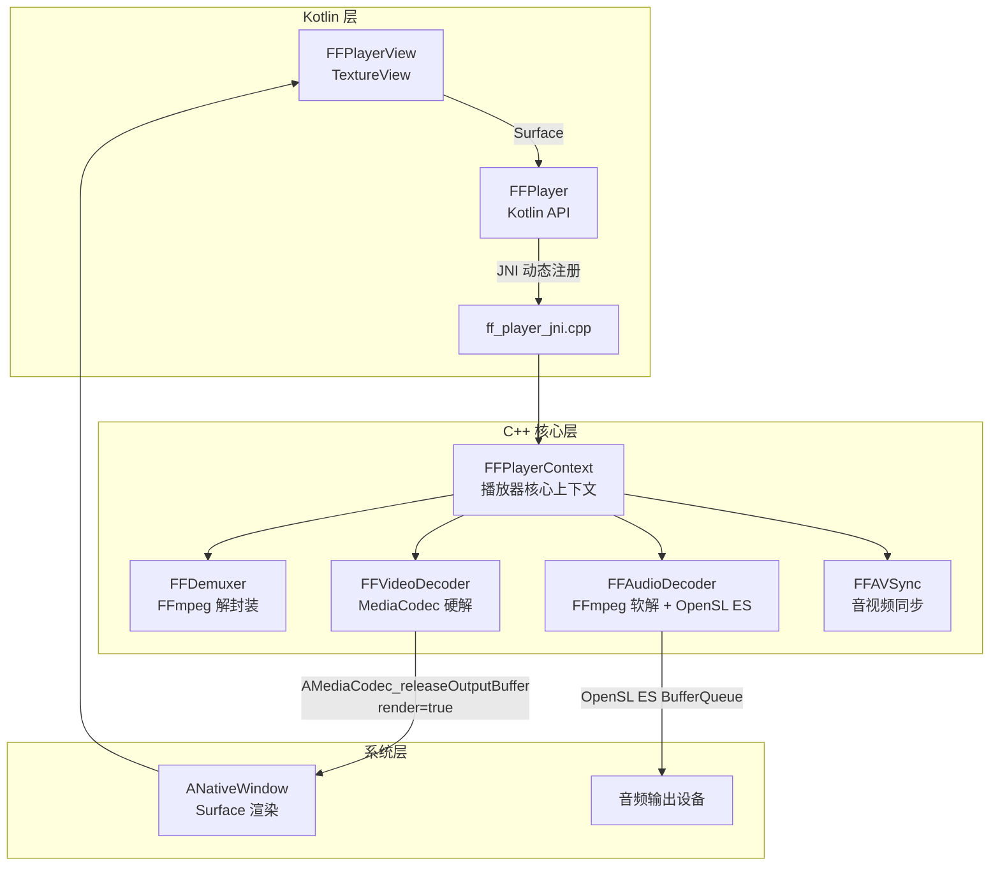
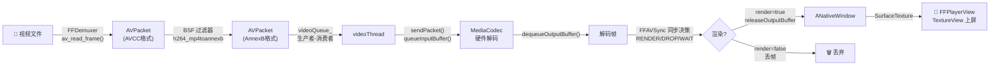

# VMFFmpegPlayer 架构与流程文档

## 项目整体架构图



---

## 完整播放时序图（从 C++ 到上屏）

```mermaid
sequenceDiagram
    participant App as App / Activity
    participant View as FFPlayerView<br/>(TextureView)
    participant Player as FFPlayer<br/>(Kotlin)
    participant JNI as ff_player_jni.cpp
    participant Ctx as FFPlayerContext
    participant Demux as FFDemuxer
    participant VDec as FFVideoDecoder<br/>(MediaCodec)
    participant ADec as FFAudioDecoder<br/>(FFmpeg+OpenSL)
    participant Sync as FFAVSync
    participant Window as ANativeWindow<br/>(Surface)
    participant Speaker as 音频设备

    Note over App,Speaker: ====== 1. 初始化阶段 ======

    App->>View: FFPlayerView 创建
    View->>View: surfaceTextureListener = this
    App->>Player: FFPlayer()
    Player->>JNI: nativeInit()
    JNI->>Ctx: new FFPlayerContext(javaVM, javaPlayer)
    Ctx-->>JNI: player 指针
    JNI->>JNI: setNativePlayer(env, thiz, player)

    Note over App,Speaker: ====== 2. Surface 就绪 ======

    View->>View: onSurfaceTextureAvailable()
    View->>Player: setSurface(Surface(surfaceTexture))
    Player->>JNI: nativeSetSurface(surface)
    JNI->>Ctx: setSurface(env, surface)
    Ctx->>Window: ANativeWindow_fromSurface(env, surface)
    Note right of Ctx: 保存 nativeWindow_ 指针

    Note over App,Speaker: ====== 3. 准备阶段 (prepare) ======

    App->>Player: setDataSource(path) + prepare()
    Player->>JNI: nativePrepare(path)
    JNI->>Ctx: prepare(path)

    Ctx->>Demux: new FFDemuxer() → open(path)
    Demux->>Demux: avformat_open_input()<br/>avformat_find_stream_info()
    Demux-->>Ctx: videoStreamIndex / audioStreamIndex

    Ctx->>Ctx: new FFAVSync()

    Ctx->>VDec: new FFVideoDecoder()
    Ctx->>VDec: init(codecParams, nativeWindow_)
    VDec->>VDec: AMediaCodec_createDecoderByType("video/avc")
    VDec->>VDec: extractCsd() → 设置 csd-0 (SPS/PPS)
    VDec->>VDec: AMediaCodec_configure(codec, format, window, ...)
    VDec->>VDec: AMediaCodec_start()
    Note right of VDec: MediaCodec 配置输出到 ANativeWindow

    Ctx->>Ctx: 创建 BSF (h264_mp4toannexb)
    Ctx->>Ctx: av_bsf_alloc() → av_bsf_init()

    Ctx->>ADec: new FFAudioDecoder()
    Ctx->>ADec: init(audioCodecParams)
    ADec->>ADec: avcodec_find_decoder() → avcodec_open2()
    ADec->>ADec: swr_alloc_set_opts2() (重采样到 PCM S16 44100Hz 双声道)
    ADec->>ADec: initOpenSLES() → 创建引擎/混音器/播放器
    ADec->>ADec: RegisterCallback(bufferQueueCallback)
    ADec->>Speaker: Enqueue(静音数据) 启动回调链

    Ctx-->>Player: notifyPrepared() + notifyVideoSizeChanged()
    Player-->>App: listener.onPrepared()
    Player-->>View: setVideoSize(w, h)
    View->>View: adjustAspectRatio() → setTransform(matrix)

    Note over App,Speaker: ====== 4. 播放阶段 (start) ======

    App->>Player: start()
    Player->>JNI: nativeStart()
    JNI->>Ctx: start()
    Ctx->>Ctx: 启动 3 个工作线程

    Note over App,Speaker: ━━━ readThread (解封装线程) ━━━

    loop 循环读包
        Ctx->>Demux: readPacket(packet)
        Demux->>Demux: av_read_frame(formatCtx, packet)
        Demux-->>Ctx: AVPacket

        alt 视频包
            Ctx->>Ctx: av_bsf_send_packet() (AVCC → AnnexB)
            Ctx->>Ctx: av_bsf_receive_packet()
            Ctx->>Ctx: av_rescale_q(pts → 微秒)
            Ctx->>Ctx: videoQueue_.push(packet)
        else 音频包
            Ctx->>Ctx: av_rescale_q(pts → 微秒)
            Ctx->>Ctx: audioQueue_.push(packet)
        end
    end

    Note over App,Speaker: ━━━ videoThread (视频解码 + 同步 + 上屏线程) ━━━

    loop 循环解码渲染
        Ctx->>Ctx: videoQueue_.pop() 取出 AVPacket

        Ctx->>VDec: sendPacket(packet)
        VDec->>VDec: AMediaCodec_dequeueInputBuffer()
        VDec->>VDec: memcpy(data → inputBuffer)
        VDec->>VDec: AMediaCodec_queueInputBuffer(bufIdx, ptsUs)

        Ctx->>VDec: dequeueFrame(ptsUs, bufIdx)
        VDec->>VDec: AMediaCodec_dequeueOutputBuffer()
        VDec-->>Ctx: ptsUs, bufIdx

        Note over Ctx,Sync: 音视频同步决策
        Ctx->>ADec: getAudioClockUs()
        ADec-->>Ctx: audioClockUs (当前音频播放时间)
        Ctx->>Sync: sync(videoPtsUs, audioClockUs, waitTimeUs)

        alt diff > 40ms (视频超前)
            Sync-->>Ctx: WAIT + waitTimeUs
            Ctx->>Ctx: usleep(waitTimeUs) 等待
            Ctx->>VDec: releaseFrame(bufIdx, render=true)
        else diff < -100ms (视频严重落后)
            Sync-->>Ctx: DROP
            Ctx->>VDec: releaseFrame(bufIdx, render=false)
            Note right of Ctx: 丢帧，不渲染
        else -100ms ≤ diff ≤ 40ms (正常范围)
            Sync-->>Ctx: RENDER
            Ctx->>VDec: releaseFrame(bufIdx, render=true)
        end

        VDec->>Window: AMediaCodec_releaseOutputBuffer(bufIdx, true)
        Note over Window: MediaCodec 将解码帧<br/>直接写入 ANativeWindow

        Window->>View: SurfaceTexture 收到新帧
        View->>View: onSurfaceTextureUpdated()
        Note over View: TextureView 合成显示<br/>画面上屏 ✅
    end

    Note over App,Speaker: ━━━ audioThread (音频解码线程) ━━━

    loop 循环解码
        Ctx->>Ctx: audioQueue_.pop() 取出 AVPacket
        Ctx->>ADec: sendPacket(packet)
        ADec->>ADec: avcodec_send_packet(codecCtx, packet)

        Ctx->>ADec: decodeFrame()
        ADec->>ADec: avcodec_receive_frame() → AVFrame
        ADec->>ADec: swr_convert() → PCM S16 数据
        ADec->>ADec: bufferQueue.push(AudioBuffer{data, ptsUs})
    end

    Note over ADec,Speaker: OpenSL ES 回调链驱动播放
    Speaker->>ADec: bufferQueueCallback() (上一个 buffer 播完)
    ADec->>ADec: bufferQueue.pop() 取出 PCM 数据
    ADec->>ADec: audioClockUs = ptsUs (更新音频时钟)
    ADec->>Speaker: Enqueue(PCM data) → 硬件播放
```



---

## 视频帧上屏的关键路径（精简版）



---

## 各模块职责

| 模块 | 文件 | 职责 |
|------|------|------|
| **FFPlayerView** | `FFPlayerView.kt` | TextureView，管理 Surface 生命周期，Matrix 画面比例适配 |
| **FFPlayer** | `FFPlayer.kt` | Kotlin API 层，JNI 桥接，主线程回调转发 |
| **ff_player_jni** | `ff_player_jni.cpp` | JNI 动态注册，Kotlin ↔ C++ 方法映射 |
| **FFPlayerContext** | `ff_player_context.cpp/h` | 播放器核心，管理 3 个工作线程（read/video/audio），Packet 队列，状态机 |
| **FFDemuxer** | `ff_demuxer.cpp/h` | FFmpeg 解封装，`av_read_frame()` 读取 AVPacket |
| **FFVideoDecoder** | `ff_video_decoder.cpp/h` | MediaCodec NDK 硬解码，输出到 ANativeWindow |
| **FFAudioDecoder** | `ff_audio_decoder.cpp/h` | FFmpeg 软解码 + SwrResample 重采样 + OpenSL ES 播放 |
| **FFAVSync** | `ff_av_sync.cpp/h` | 以音频时钟为主时钟，决策视频帧 RENDER / WAIT / DROP |

---

## 关键设计要点

### 1. 三线程模型

```
readThread  ──→ videoQueue_ ──→ videoThread (解码+同步+渲染)
            ──→ audioQueue_ ──→ audioThread (解码+缓冲)
                                    ↓
                              OpenSL ES 回调 (播放)
```

- **readThread**：负责解封装，从文件中读取 AVPacket 并分发到视频/音频队列
- **videoThread**：从视频队列取包 → MediaCodec 硬解 → 音视频同步 → 上屏/丢帧
- **audioThread**：从音频队列取包 → FFmpeg 软解 → SwrResample → 写入缓冲区

### 2. 视频上屏零拷贝

MediaCodec 在 `configure` 阶段直接绑定 `ANativeWindow`（即 Surface），调用 `AMediaCodec_releaseOutputBuffer(bufIdx, render=true)` 时，解码帧直接输出到 Surface，**无需经过 CPU 拷贝**，这是性能最优的渲染路径。

### 3. 音频驱动同步

音频时钟 `audioClockUs` 在 OpenSL ES 的 `bufferQueueCallback` 中更新（每次取出新的 PCM buffer 时更新为该 buffer 的 PTS）。视频线程每帧都读取音频时钟，计算差值后决策：

| 差值范围 | 决策 | 行为 |
|---------|------|------|
| `diff > 40ms` | **WAIT** | 视频超前，`usleep(waitTimeUs)` 后再渲染 |
| `-100ms ≤ diff ≤ 40ms` | **RENDER** | 正常范围，直接渲染 |
| `diff < -100ms` | **DROP** | 视频严重落后，丢弃该帧不渲染 |

### 4. BSF 过滤器（Bitstream Filter）

MP4 容器中 H.264 数据使用 **AVCC 格式**（长度前缀），而 MediaCodec 要求 **AnnexB 格式**（`00 00 00 01` 起始码）。通过 FFmpeg 的 `h264_mp4toannexb` BSF 过滤器在送入解码器前自动完成格式转换。

### 5. 画面比例适配

`FFPlayerView` 继承 `TextureView`，在收到视频宽高回调后，通过计算 `Matrix` 变换矩阵实现等比缩放居中显示（FitCenter），避免画面拉伸变形。
