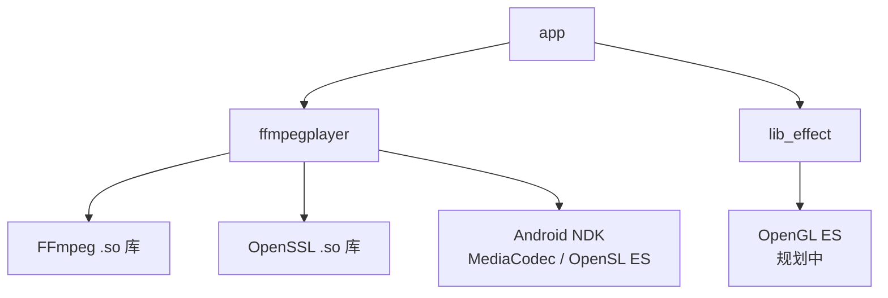
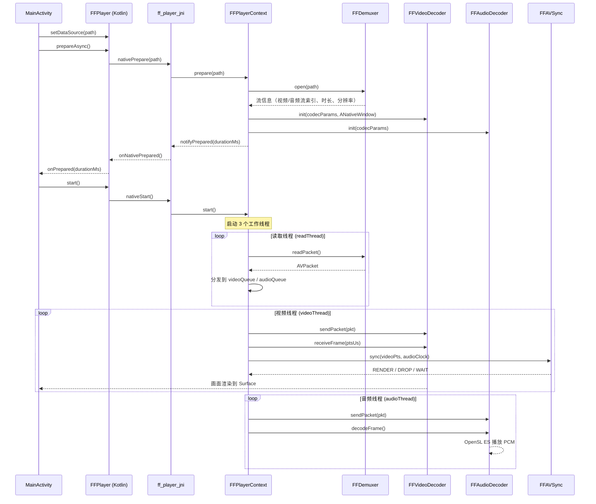
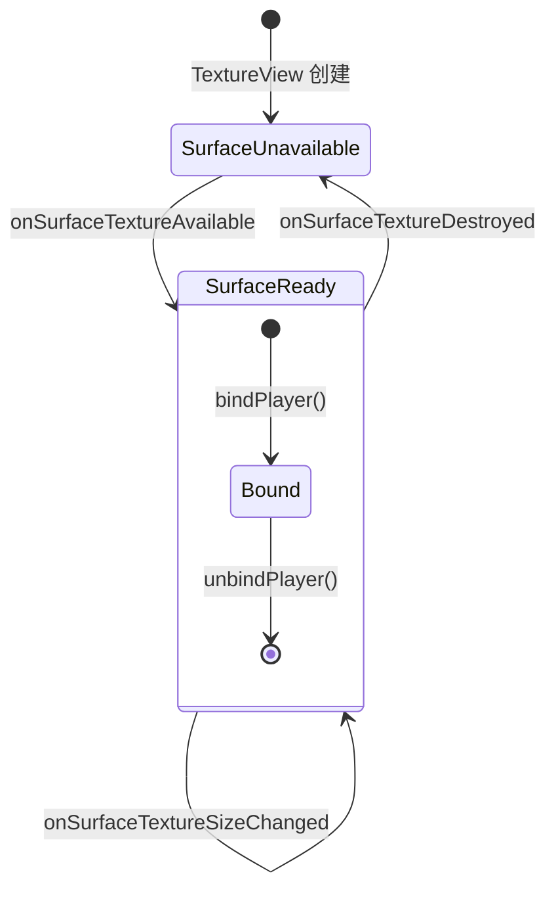
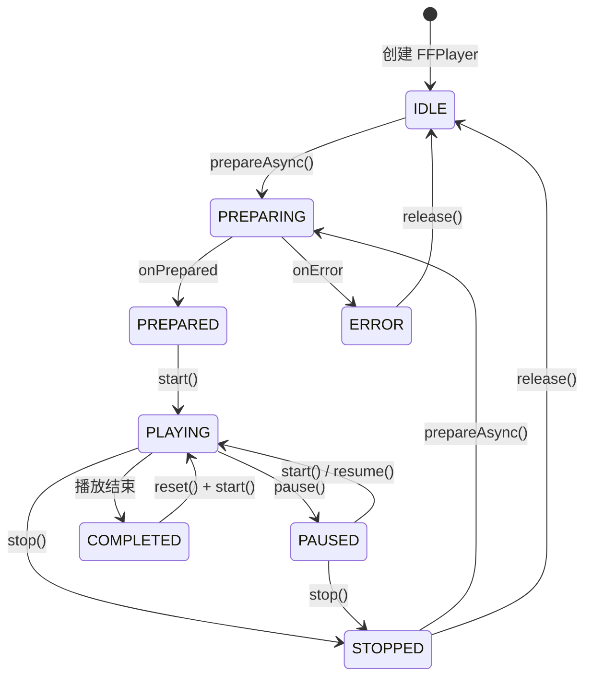

# VMFFmpegPlayer — 基于 Android + FFmpeg + MediaCodec 的特效视频播放器技术文档

## 文档版本：V2.0
## 适用平台：Android
## 核心技术栈：FFmpeg 6.1.1、Android MediaCodec (NDK)、OpenGL ES、OpenSL ES

---

## 一、文档概述

### 1.1 文档目的

本文档定义 **VMFFmpegPlayer** 项目的技术架构、功能模块、实现方案、接口规范与性能要求。项目目标是构建一个支持 **实时特效、片段拼接、多源播放、视频导出** 的 Android 视频播放器，为开发、测试、维护提供统一技术标准。

### 1.2 核心技术组合说明

| 技术 | 职责 | 当前实现状态 |
|------|------|-------------|
| **FFmpeg 6.1.1** | 解封装（Demuxer）、音频软解码、音频重采样、比特流过滤（BSF）、网络协议支持 | ✅ 已实现 |
| **MediaCodec (NDK)** | H.264/H.265 硬件解码，输出到 ANativeWindow | ✅ 已实现 |
| **OpenSL ES** | 低延迟音频 PCM 播放 | ✅ 已实现 |
| **OpenGL ES** | 实时画面渲染、特效叠加、转场动画、LUT 滤镜预览 | 🔲 规划中（lib_effect 模块） |
| **OpenSSL 3.2.1** | HTTPS/TLS 网络视频流加密传输 | ✅ 已实现 |

### 1.3 运行环境

| 项目 | 要求 |
|------|------|
| 最低 API | Android API 28 (Android 9.0) |
| 编译 SDK | API 33 (Android 13) |
| NDK 版本 | 21.4.7075529 |
| C++ 标准 | C++17 |
| JVM Target | Java 11 |
| 支持架构 | `arm64-v8a`（主要）、`armeabi-v7a`（兼容） |
| 内存要求 | ≥ 2GB |
| 存储要求 | 导出视频需预留源文件 2 倍以上空间 |
| 网络要求 | 远程视频播放需稳定 WiFi / 移动网络 |

---

## 二、项目工程结构

### 2.1 模块划分

```
VMFFmpegPlayer/                     # 根项目
├── app/                            # Demo 应用模块（展示播放器各种操作）
│   ├── src/main/java/.../          # Kotlin 应用层代码
│   │   └── MainActivity.kt        # 主界面：播放控制、视频源切换、画面模式
│   ├── src/main/res/layout/        # UI 布局
│   │   └── activity_main.xml      # 播放器 + 控制面板布局
│   └── src/main/assets/            # 本地测试视频
│       ├── sample.mp4              # 标准测试视频
│       ├── hdr10-720p.mp4          # HDR10 测试视频
│       └── 8k24fps_300ms.mp4       # 8K 超高分辨率测试视频
│
├── ffmpegplayer/                   # 核心播放器模块（Library）
│   ├── src/main/java/.../          # Kotlin 播放器 API 层
│   │   ├── FFPlayer.kt             # 播放器核心类（JNI 桥接）
│   │   └── FFPlayerView.kt         # 视频渲染视图（TextureView）
│   ├── src/main/cpp/               # C++ 原生引擎层
│   │   ├── CMakeLists.txt          # CMake 构建配置
│   │   ├── ff_player_jni.cpp       # JNI 动态注册 & 方法桥接
│   │   ├── ff_player_context.cpp/h # 播放器核心上下文（线程调度中枢）
│   │   ├── ff_demuxer.cpp/h        # FFmpeg 解封装器
│   │   ├── ff_video_decoder.cpp/h  # MediaCodec H.264/H.265 硬解码器
│   │   ├── ff_audio_decoder.cpp/h  # FFmpeg 音频软解码 + OpenSL ES 播放
│   │   └── ff_av_sync.cpp/h        # 音视频同步管理器
│   ├── src/main/jniLibs/           # 预编译 .so 库
│   │   ├── arm64-v8a/              # 64 位 ARM 架构
│   │   └── armeabi-v7a/            # 32 位 ARM 架构
│   └── build_ffmpeg.sh             # FFmpeg + OpenSSL 交叉编译脚本
│
├── lib_effect/                     # 特效渲染模块（Library，规划中）
│   └── src/main/                   # OpenGL ES 特效渲染相关逻辑
│
├── docs/                           # 技术文档
│   └── tech.md                     # 本文档
│
├── deps.gradle                     # 统一依赖版本管理
├── settings.gradle                 # 模块注册
└── build.gradle                    # 根构建脚本
```

### 2.2 模块依赖关系



### 2.3 语言架构

| 层级 | 语言 | 说明 |
|------|------|------|
| 应用层 (app) | Kotlin | UI 交互、播放控制、视频源管理 |
| API 层 (ffmpegplayer/java) | Kotlin | 播放器公开接口、Surface 管理、回调分发 |
| JNI 桥接层 | C++ | 动态注册 Native 方法、Java ↔ C++ 数据转换 |
| 原生引擎层 | C++ | 解封装、解码、音视频同步、线程管理 |
| 第三方库 | C | FFmpeg、OpenSSL 预编译库 |

---

## 三、整体架构设计

### 3.1 分层架构

```
┌─────────────────────────────────────────────────────────────┐
│                    上层 UI 交互层 (app)                      │
│  MainActivity: 播放控制、视频源切换、进度条、画面模式切换     │
├─────────────────────────────────────────────────────────────┤
│                    Kotlin API 层 (ffmpegplayer)              │
│  FFPlayer: 播放器核心接口                                    │
│  FFPlayerView: TextureView 渲染 + 画面缩放                  │
├─────────────────────────────────────────────────────────────┤
│                    JNI 桥接层 (ff_player_jni.cpp)            │
│  动态注册 16 个 Native 方法、JavaVM 缓存、回调分发           │
├─────────────────────────────────────────────────────────────┤
│                    C++ 核心引擎层                             │
│  FFPlayerContext: 线程调度中枢（读取线程 + 视频线程 + 音频线程）│
│  FFDemuxer: FFmpeg 解封装（本地文件 / fd / 网络 URL）        │
│  FFVideoDecoder: MediaCodec NDK 硬解码 → ANativeWindow      │
│  FFAudioDecoder: FFmpeg 软解码 → SwrResample → OpenSL ES    │
│  FFAVSync: 音频时钟驱动的音视频同步                          │
├─────────────────────────────────────────────────────────────┤
│                    基础支撑层                                 │
│  FFmpeg 6.1.1 (.so) + OpenSSL 3.2.1 (.so)                  │
│  Android NDK: MediaCodec / OpenSL ES / ANativeWindow        │
└─────────────────────────────────────────────────────────────┘
```

### 3.2 核心播放流程



### 3.3 线程模型

`FFPlayerContext` 内部管理 3 个工作线程：

| 线程 | 职责 | 关键操作 |
|------|------|---------|
| **readThread** | 读取线程 | `FFDemuxer::readPacket()` → 按流索引分发到 `videoQueue_` / `audioQueue_` |
| **videoThread** | 视频解码渲染线程 | 从 `videoQueue_` 取包 → `FFVideoDecoder` 硬解 → `FFAVSync` 同步 → 渲染 |
| **audioThread** | 音频解码播放线程 | 从 `audioQueue_` 取包 → `FFAudioDecoder` 软解 → OpenSL ES 播放 |

**线程间通信**：通过 `PacketQueue`（`std::vector<AVPacket*>` + `std::mutex` + `std::condition_variable`）实现生产者-消费者模型，队列上限 128 个包。

---

## 四、功能模块详细设计

### 4.1 视频源播放模块（已实现）

#### 4.1.1 功能描述

支持本地视频文件播放和网络远程视频（HTTP/HTTPS）流式播放。

#### 4.1.2 技术实现

**本地播放**：
- 支持文件路径方式：`FFDemuxer::open(path)` 直接读取
- 支持 `content://` URI 方式：通过 `ContentResolver` 获取 fd → `FFDemuxer::openFd(fd)` 使用 `pipe:` 协议
- assets 资源：运行时复制到 `cacheDir`，再通过文件路径播放

**远程播放**：
- FFmpeg 内置 HTTP/HTTPS 协议支持（编译时启用 `--enable-protocol=http,https,tls`）
- OpenSSL 3.2.1 提供 TLS 加密支持
- 支持中断回调 `FFDemuxer::interruptCallback()` 实现超时控制和取消操作
- `FFDemuxer::abort()` / `resetAbort()` 控制网络 IO 中断

**格式支持**（编译时启用的解封装器）：

| 格式 | 解封装器 |
|------|---------|
| MP4/MOV | `mov` |
| MKV/WebM | `matroska` |
| MPEG-TS | `mpegts` |
| FLV | `flv` |
| AVI | `avi` |
| HLS | `hls` |
| MP3 | `mp3` |
| AAC | `aac` |
| WAV | `wav` |

**编解码器支持**：

| 类型 | 编解码器 | 方式 |
|------|---------|------|
| H.264 视频 | `h264_mediacodec` | 硬件解码 |
| H.265/HEVC 视频 | `hevc_mediacodec` | 硬件解码 |
| H.264 视频 | `h264`（软解回退） | 软件解码 |
| H.265 视频 | `hevc`（软解回退） | 软件解码 |
| AAC 音频 | `aac` | 软件解码 |
| MP3 音频 | `mp3` | 软件解码 |
| PCM 音频 | `pcm_s16le` | 直接输出 |

#### 4.1.3 代码示例：播放一个视频

```kotlin
// 1. 创建播放器
val player = FFPlayer()
player.setListener(this) // 实现 FFPlayer.Listener

// 2. 绑定渲染视图
val playerView = findViewById<FFPlayerView>(R.id.playerView)
playerView.bindPlayer(player)

// 3. 设置数据源（本地文件或远程 URL）
player.setDataSource("/sdcard/video.mp4")
// 或者：player.setDataSource("https://example.com/video.mp4")
// 或者：player.setDataSource(context, contentUri)

// 4. 异步准备
player.prepareAsync()

// 5. 在 onPrepared 回调中开始播放
override fun onPrepared(durationMs: Long) {
    player.start()
}

// 6. 释放资源
override fun onDestroy() {
    player.release()
}
```

### 4.2 视频解码模块（已实现）

#### 4.2.1 硬解码流程

```
FFDemuxer 解封装
    ↓
AVPacket (H.264/H.265 AVCC 格式)
    ↓
AVBSFContext (h264_mp4toannexb / hevc_mp4toannexb)
    ↓
AVPacket (AnnexB 格式，带 start code)
    ↓
FFVideoDecoder::sendPacket() → AMediaCodec_queueInputBuffer()
    ↓
FFVideoDecoder::receiveFrame() → AMediaCodec_dequeueOutputBuffer()
    ↓
AMediaCodec_releaseOutputBuffer(render=true) → ANativeWindow 渲染
```

#### 4.2.2 关键技术点

1. **AVCC → AnnexB 转换**：MP4 容器中 H.264 使用 AVCC 格式（长度前缀），MediaCodec 需要 AnnexB 格式（start code 前缀 `00 00 00 01`），通过 FFmpeg BSF（Bitstream Filter）自动转换。

2. **CSD 数据提取**：`FFVideoDecoder::extractCsd()` 从 `AVCodecParameters::extradata` 中提取 SPS/PPS，构造 MediaCodec 所需的 `csd-0` / `csd-1` 参数。

3. **Seek 精确定位**：
   - `seekRequest_` 原子标志触发 seek
   - 读取线程调用 `FFDemuxer::seek()` 定位到关键帧
   - 刷新 `videoQueue_` / `audioQueue_`
   - `FFVideoDecoder::flush()` 重置解码器
   - `seekTargetUs_` 记录精确目标时间，丢弃 PTS < 目标的帧
   - `seekDoneWhilePaused_` 支持暂停状态下拖动进度条实时预览

### 4.3 音频解码与播放模块（已实现）

#### 4.3.1 音频处理流程

```
AVPacket (AAC/MP3)
    ↓
FFmpeg AVCodecContext 软解码
    ↓
AVFrame (原始采样格式，如 fltp/s16p)
    ↓
SwrContext 重采样（统一为 PCM S16 LE, 44100Hz, 双声道）
    ↓
AudioBuffer 队列
    ↓
OpenSL ES BufferQueue 回调播放
    ↓
更新 audioClockUs（作为音视频同步的主时钟）
```

#### 4.3.2 关键参数

| 参数 | 值 |
|------|-----|
| 输出采样率 | 44100 Hz |
| 输出声道数 | 2（立体声） |
| 输出格式 | PCM S16 LE |
| 缓冲队列 | `std::queue<AudioBuffer>` + 互斥锁 |

### 4.4 音视频同步模块（已实现）

#### 4.4.1 同步策略

采用 **音频时钟为主时钟** 的同步方案：

```
FFAVSync::sync(videoPtsUs, audioClockUs) → SyncAction
```

| 条件 | 动作 | 说明 |
|------|------|------|
| 视频 PTS 超前音频 > 40ms | `WAIT` | 等待，返回需要等待的时间 |
| 视频 PTS 落后音频 > 100ms | `DROP` | 丢帧，追赶音频进度 |
| 其他情况 | `RENDER` | 立即渲染 |

#### 4.4.2 同步参数

| 参数 | 默认值 | 说明 |
|------|--------|------|
| `syncThresholdUs` | 40,000 μs (40ms) | 视频超前阈值，超过则等待 |
| `maxDropThresholdUs` | 100,000 μs (100ms) | 视频落后阈值，超过则丢帧 |

### 4.5 视频渲染视图模块（已实现）

#### 4.5.1 FFPlayerView 功能

基于 `TextureView` 实现，支持 4 种画面适配模式：

| 模式 | 枚举值 | 说明 |
|------|--------|------|
| 居中显示 | `CENTER_INSIDE` | 保持宽高比，完整显示，可能有黑边（默认） |
| 裁剪填充 | `CENTER_CROP` | 保持宽高比，裁剪溢出部分填满视图 |
| 拉伸铺满 | `FIT_XY` | 拉伸到视图尺寸，可能变形 |
| 原始尺寸 | `ORIGINAL` | 按视频原始像素尺寸居中显示 |

#### 4.5.2 画面缩放原理

`TextureView` 默认将内容拉伸到整个 View 尺寸（等同于 `FIT_XY`），通过 `Matrix` 变换实现不同的适配模式：

```kotlin
// 以 CENTER_INSIDE 为例
val matrix = Matrix()
if (videoRatio > viewRatio) {
    // 视频更宽，以宽度为基准
    scaleX = 1f
    scaleY = viewRatio / videoRatio
} else {
    // 视频更高，以高度为基准
    scaleX = videoRatio / viewRatio
    scaleY = 1f
}
matrix.setScale(scaleX, scaleY, viewWidth / 2f, viewHeight / 2f)
setTransform(matrix)
```

#### 4.5.3 Surface 生命周期管理



- Surface 就绪后自动调用 `player.setSurface()`
- Surface 销毁时自动调用 `player.setSurface(null)`
- 支持 `onSurfaceReady` 回调，用于延迟加载视频

### 4.6 多片段视频拼接播放模块（规划中）

#### 4.6.1 功能描述

支持选择多个本地视频自动拼接，实现无缝连续播放，无需预导出。

#### 4.6.2 技术方案

- FFmpeg 解析所有片段的时长、分辨率、编码格式、帧率
- 统一时间戳，自动处理分辨率不一致的缩放适配
- 播放时无缝切换片段，无黑屏、无卡顿
- 支持片段增删、顺序调整
- 播放进度条统一显示总时长

### 4.7 特效与转场模块（规划中，lib_effect）

#### 4.7.1 支持特效清单

| 分类 | 具体特效 | 实现技术 |
|------|---------|---------|
| 画面特效 | LUT 滤镜、亮度/对比度/饱和度/锐度 | OpenGL ES + FFmpeg 滤镜 |
| 播放特效 | 慢放 0.5x、快放 1-4x、逐帧播放 | FFmpeg 帧速率控制 + 音视频同步 |
| 音频特效 | 自定义 BGM、原声音量、音效混音 | FFmpeg 音频混音、重采样 |
| 转场特效 | 淡入淡出、滑动、缩放、旋转、闪白 | OpenGL 片段着色器 + 帧插值 |

#### 4.7.2 关键技术点

1. **LUT 滤镜**：加载 `.cube` 格式 LUT 文件，OpenGL 实时渲染，支持滤镜强度调节（0-100%）
2. **快慢放**：视频变速不改变音调，音频自动重采样保持同步
3. **BGM 混音**：原声/BGM 音量独立控制，自动裁剪/循环匹配视频总时长
4. **转场动画**：GPU 渲染，转场时长可配置（0.2s~1s）

### 4.8 视频导出模块（规划中）

#### 4.8.1 导出配置项

| 配置 | 可选值 |
|------|--------|
| 分辨率 | 480P / 720P / 1080P / 2K / 4K |
| 码率 | 低/中/高/自定义 |
| 帧率 | 24 / 30 / 60 fps |
| 编码格式 | H.264 / H.265 |
| 音频码率 | 64kbps ~ 320kbps |
| 导出格式 | MP4 |

#### 4.8.2 导出流程

```
视频序列 + 转场 + 滤镜 → MediaCodec 硬编码
原始音频 + BGM + 音量调节 → FFmpeg 混音
编码后音视频 → FFmpeg 封装 → 最终 MP4
```

---

## 五、接口设计

### 5.1 FFPlayer — 播放器核心类

**包名**：`com.vompom.ffmpegplayer.FFPlayer`

#### 5.1.1 播放器状态

```kotlin
companion object {
    const val STATE_IDLE = 0        // 空闲
    const val STATE_PREPARING = 1   // 准备中
    const val STATE_PREPARED = 2    // 准备就绪
    const val STATE_PLAYING = 3     // 播放中
    const val STATE_PAUSED = 4      // 暂停
    const val STATE_STOPPED = 5     // 停止
    const val STATE_COMPLETED = 6   // 播放完成
    const val STATE_ERROR = 7       // 错误
}
```

#### 5.1.2 状态转换图



#### 5.1.3 公开方法

| 方法 | 签名 | 说明 |
|------|------|------|
| `setListener` | `fun setListener(listener: Listener)` | 设置回调监听 |
| `setSurface` | `fun setSurface(surface: Surface?)` | 设置渲染 Surface |
| `setDataSource` | `fun setDataSource(path: String)` | 通过文件路径设置数据源 |
| `setDataSource` | `fun setDataSource(context: Context, uri: Uri)` | 通过 content:// URI 设置数据源 |
| `prepare` | `fun prepare(): Int` | 同步准备（阻塞当前线程） |
| `prepareAsync` | `fun prepareAsync()` | 异步准备（后台线程执行） |
| `start` | `fun start()` | 开始播放 |
| `pause` | `fun pause()` | 暂停 |
| `resume` | `fun resume()` | 恢复播放 |
| `stop` | `fun stop()` | 停止播放 |
| `seekTo` | `fun seekTo(positionMs: Long)` | Seek 到指定位置（毫秒） |
| `reset` | `fun reset()` | 重置状态以便重新播放 |
| `release` | `fun release()` | 释放所有资源 |
| `getDuration` | `fun getDuration(): Long` | 获取总时长（毫秒） |
| `getCurrentPosition` | `fun getCurrentPosition(): Long` | 获取当前位置（毫秒） |
| `getState` | `fun getState(): Int` | 获取当前状态 |
| `getVideoWidth` | `fun getVideoWidth(): Int` | 获取视频宽度 |
| `getVideoHeight` | `fun getVideoHeight(): Int` | 获取视频高度 |
| `isPlaying` | `fun isPlaying(): Boolean` | 是否正在播放 |

#### 5.1.4 回调接口

```kotlin
interface Listener {
    /** 准备完成，返回视频总时长（毫秒） */
    fun onPrepared(durationMs: Long) {}

    /** 播放进度更新 */
    fun onProgress(currentMs: Long, totalMs: Long) {}

    /** 播放完成 */
    fun onCompletion() {}

    /** 播放错误 */
    fun onError(code: Int, message: String) {}

    /** 视频尺寸变化 */
    fun onVideoSizeChanged(width: Int, height: Int) {}

    /** 播放器状态变化 */
    fun onStateChanged(state: Int) {}
}
```

### 5.2 FFPlayerView — 视频渲染视图

**包名**：`com.vompom.ffmpegplayer.FFPlayerView`

| 方法 | 签名 | 说明 |
|------|------|------|
| `bindPlayer` | `fun bindPlayer(player: FFPlayer)` | 绑定播放器 |
| `unbindPlayer` | `fun unbindPlayer()` | 解绑播放器 |
| `setVideoSize` | `fun setVideoSize(width: Int, height: Int)` | 设置视频尺寸，触发画面缩放 |
| `setScaleType` | `fun setScaleType(type: ScaleType)` | 设置画面适配模式 |
| `getCurrentScaleType` | `fun getCurrentScaleType(): ScaleType` | 获取当前适配模式 |

**回调属性**：

| 属性 | 类型 | 说明 |
|------|------|------|
| `onSurfaceReady` | `(() -> Unit)?` | Surface 就绪回调 |
| `onSurfaceDestroyed` | `(() -> Unit)?` | Surface 销毁回调 |
| `onVideoSizeChanged` | `((width: Int, height: Int) -> Unit)?` | 视频尺寸变化回调 |
| `isSurfaceReady` | `Boolean` (只读) | Surface 是否就绪 |

### 5.3 规划中的特效接口

```kotlin
// LUT 滤镜
fun applyLUT(lutPath: String, intensity: Int)

// 变速
fun setSpeed(speed: Float)

// 音频
fun setBGM(audioPath: String, volume: Float, originalVolume: Float)

// 转场
fun setTransitionType(type: Int, durationMs: Int)
```

### 5.4 规划中的导出接口

```kotlin
fun startExport(config: ExportConfig, callback: ExportCallback)
fun cancelExport()
```

---

## 六、JNI 桥接层设计

### 6.1 动态注册

采用 `JNI_OnLoad` + `RegisterNatives` 动态注册方式（而非静态 `JNIEXPORT` 方式），优点：
- 启动时即可发现方法签名不匹配问题
- 方法名不受 Java 包名影响
- 更好的代码组织

```cpp
// ff_player_jni.cpp
static const JNINativeMethod g_methods[] = {
    {"nativeInit",               "()V",                       (void *) nativeInit},
    {"nativePrepare",            "(Ljava/lang/String;)I",     (void *) nativePrepare},
    {"nativePrepareWithFd",      "(I)I",                      (void *) nativePrepareWithFd},
    {"nativeStart",              "()V",                       (void *) nativeStart},
    {"nativePause",              "()V",                       (void *) nativePause},
    {"nativeResume",             "()V",                       (void *) nativeResume},
    {"nativeStop",               "()V",                       (void *) nativeStop},
    {"nativeSeekTo",             "(J)V",                      (void *) nativeSeekTo},
    {"nativeRelease",            "()V",                       (void *) nativeRelease},
    {"nativeReset",              "()V",                       (void *) nativeReset},
    {"nativeSetSurface",         "(Landroid/view/Surface;)V", (void *) nativeSetSurface},
    {"nativeGetDuration",        "()J",                       (void *) nativeGetDuration},
    {"nativeGetCurrentPosition", "()J",                       (void *) nativeGetCurrentPosition},
    {"nativeGetState",           "()I",                       (void *) nativeGetState},
    {"nativeGetVideoWidth",      "()I",                       (void *) nativeGetVideoWidth},
    {"nativeGetVideoHeight",     "()I",                       (void *) nativeGetVideoHeight},
};
```

### 6.2 Native 指针管理

Kotlin 层通过 `nativeHandle: Long` 字段持有 C++ 对象指针：

```
FFPlayer.kt                    ff_player_jni.cpp
┌──────────────┐              ┌──────────────────────┐
│ nativeHandle ├──────────────► FFPlayerContext*      │
│   (Long)     │  reinterpret │ (堆上分配)            │
└──────────────┘    _cast     └──────────────────────┘
```

- `nativeInit()`：`new FFPlayerContext()` → 存入 `nativeHandle`
- `nativeRelease()`：`delete player` → `nativeHandle = 0`

### 6.3 Java 回调机制

C++ 层通过缓存的 `JavaVM*` 和 `jobject (GlobalRef)` 回调 Kotlin 层：

```cpp
void FFPlayerContext::notifyPrepared() {
    JNIEnv *env = getJNIEnv();  // AttachCurrentThread
    jclass clazz = env->GetObjectClass(javaPlayer_);
    jmethodID mid = env->GetMethodID(clazz, "onNativePrepared", "(J)V");
    env->CallVoidMethod(javaPlayer_, mid, durationMs);
    detachThread();
}
```

Kotlin 层在 `onNativePrepared()` 中通过 `mainHandler.post {}` 切换到主线程，再分发给 `Listener`。

---

## 七、构建与编译

### 7.1 FFmpeg 交叉编译

项目提供 `ffmpegplayer/build_ffmpeg.sh` 一键编译脚本：

```bash
cd ffmpegplayer && bash build_ffmpeg.sh
```

**编译配置要点**：

| 配置项 | 值 |
|--------|-----|
| FFmpeg 版本 | 6.1.1 |
| OpenSSL 版本 | 3.2.1 |
| 目标架构 | arm64-v8a, armeabi-v7a |
| API Level | 21 |
| 编译模式 | shared（动态库） |
| 启用功能 | JNI、MediaCodec、OpenSSL |
| 禁用功能 | avdevice、postproc、avfilter、programs、doc |
| 优化选项 | `--enable-small`（减小体积） |

**输出产物**：

| 库文件 | 大小 (arm64-v8a) | 说明 |
|--------|------------------|------|
| `libavformat.so` | 1.83 MB | 封装/解封装 |
| `libavcodec.so` | 7.40 MB | 编解码 |
| `libavutil.so` | 425 KB | 工具函数 |
| `libswresample.so` | 69 KB | 音频重采样 |
| `libswscale.so` | 261 KB | 图像缩放 |
| `libssl.so` | 933 KB | TLS/SSL |
| `libcrypto.so` | 4.85 MB | 加密算法 |

### 7.2 CMake 构建配置

`ffmpegplayer/src/main/cpp/CMakeLists.txt` 配置：

- 引入 FFmpeg 预编译 `.so` 库（IMPORTED）
- 引入 OpenSSL 预编译 `.so` 库
- 编译项目 Native 库 `libffplayer.so`
- 链接系统库：`log`、`android`、`mediandk`（MediaCodec NDK）、`OpenSLES`

### 7.3 Gradle 构建配置

**ffmpegplayer/build.gradle 关键配置**：

```groovy
externalNativeBuild {
    cmake {
        cppFlags "-std=c++17 -frtti -fexceptions"
        arguments "-DANDROID_STL=c++_shared"
        abiFilters "arm64-v8a"
    }
}

externalNativeBuild {
    cmake {
        path "src/main/cpp/CMakeLists.txt"
    }
}

ndkVersion '21.4.7075529'
```

### 7.4 项目构建步骤

```bash
# 1. 确保 Android SDK 和 NDK 已安装
# NDK 版本: 21.4.7075529

# 2. 编译 FFmpeg（仅首次或更新 FFmpeg 版本时需要）
cd ffmpegplayer && bash build_ffmpeg.sh

# 3. 使用 Android Studio 打开项目，或命令行构建
./gradlew assembleDebug

# 4. 安装到设备
./gradlew installDebug
```

---

## 八、性能指标要求

| 指标 | 目标值 | 说明 |
|------|--------|------|
| 本地视频启动速度 | < 300ms | 从 prepare 到首帧渲染 |
| 远程视频首开时间 | < 1.5s | 含网络连接和缓冲 |
| 1080P 播放 CPU 占用 | < 20% | 硬解码场景 |
| 4K 播放 | 流畅 | 依赖设备硬解能力 |
| 导出速度 | ≥ 2x 实时 | 1080P 视频硬编码 |
| 特效切换 | 实时响应 | 无感知延迟 |
| 崩溃率 | ≤ 0.1% | 生产环境 |
| Seek 响应 | < 200ms | 关键帧定位 + 精确 seek |

---

## 九、异常处理机制

| 异常场景 | 处理策略 |
|---------|---------|
| 文件无法解码 | `onError` 回调，提示格式不支持 |
| 远程播放网络中断 | `FFDemuxer::interruptCallback()` 超时检测，`onError` 回调 |
| Surface 未就绪 | `pendingLoadVideo` 标记延迟加载，等待 `onSurfaceReady` 回调 |
| Native 库加载失败 | `FFPlayer.nativeLoaded = false`，所有操作安全跳过 |
| MediaCodec 不支持 | 回退到 FFmpeg 软解码（h264/hevc 软解码器已编译） |
| 内存不足 | PacketQueue 上限 128 包，防止无限缓冲 |
| 播放完成 | `onCompletion` 回调，支持自动重播（`reset()` + `start()`） |
| Seek 期间状态保护 | 原子变量 `seekRequest_` / `seekDoneWhilePaused_` 保证线程安全 |

---

## 十、扩展性设计

### 10.1 已预留的扩展点

| 扩展方向 | 实现方式 |
|---------|---------|
| 特效插件 | `lib_effect` 模块独立开发，通过 OpenGL ES 管线接入 |
| 新增转场 | 添加 GLSL 着色器文件即可 |
| 导出格式 | FFmpeg 支持 MOV、MKV 等多种封装格式 |
| 贴纸/文字/水印 | OpenGL ES 纹理叠加 |
| 直播流特效 | 复用现有渲染管线 |
| HLS 直播 | FFmpeg 已编译 HLS 解封装器 |
| 更多编解码器 | 修改 `build_ffmpeg.sh` 启用更多 decoder/demuxer |

### 10.2 架构扩展原则

1. **模块化**：每个功能模块独立为 Android Library，通过 Gradle 依赖组合
2. **低耦合**：C++ 层各子模块（Demuxer/Decoder/Sync）通过接口交互，可独立替换
3. **线程安全**：所有跨线程操作使用 `std::atomic` / `std::mutex` / `std::condition_variable`
4. **回调分层**：C++ → JNI → Kotlin mainHandler → Listener，确保 UI 线程安全

---

## 十一、附录

### A. 预编译库清单

| 库 | 版本 | 架构 | 用途 |
|----|------|------|------|
| libavformat.so | FFmpeg 6.1.1 | arm64-v8a / armeabi-v7a | 解封装 |
| libavcodec.so | FFmpeg 6.1.1 | arm64-v8a / armeabi-v7a | 编解码 |
| libavutil.so | FFmpeg 6.1.1 | arm64-v8a / armeabi-v7a | 工具函数 |
| libswresample.so | FFmpeg 6.1.1 | arm64-v8a / armeabi-v7a | 音频重采样 |
| libswscale.so | FFmpeg 6.1.1 | arm64-v8a / armeabi-v7a | 图像缩放 |
| libssl.so | OpenSSL 3.2.1 | arm64-v8a / armeabi-v7a | TLS/SSL |
| libcrypto.so | OpenSSL 3.2.1 | arm64-v8a / armeabi-v7a | 加密算法 |

### B. 系统库依赖

| 库 | 用途 |
|----|------|
| `liblog.so` | Android 日志 |
| `libandroid.so` | ANativeWindow |
| `libmediandk.so` | MediaCodec NDK API |
| `libOpenSLES.so` | OpenSL ES 音频播放 |

### C. 关键文件索引

| 文件 | 行数 | 说明 |
|------|------|------|
| `FFPlayer.kt` | 319 | 播放器 Kotlin API |
| `FFPlayerView.kt` | 198 | 视频渲染视图 |
| `ff_player_context.cpp` | ~800 | 播放器核心上下文（最大文件） |
| `ff_player_context.h` | 204 | 核心上下文头文件（含 PacketQueue） |
| `ff_player_jni.cpp` | 185 | JNI 桥接层 |
| `ff_demuxer.cpp/h` | ~220 | FFmpeg 解封装器 |
| `ff_video_decoder.cpp/h` | ~200 | MediaCodec 硬解码器 |
| `ff_audio_decoder.cpp/h` | ~300 | 音频解码 + OpenSL ES |
| `ff_av_sync.cpp/h` | ~60 | 音视频同步 |
| `MainActivity.kt` | ~460 | Demo 应用主界面 |

---